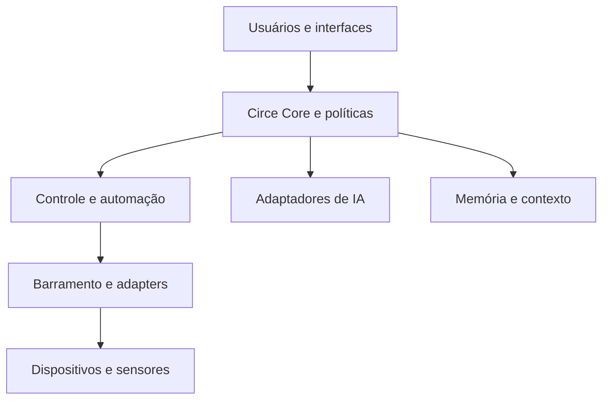
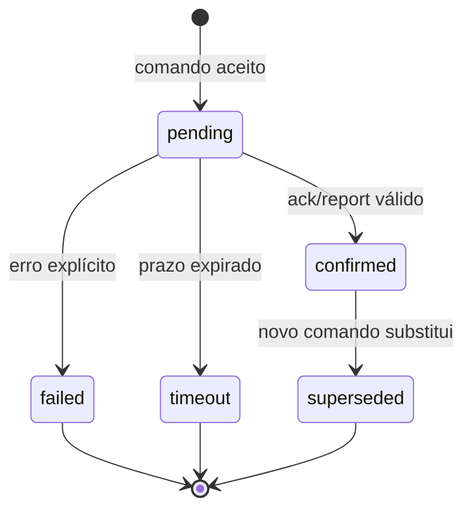

# CIRCE OS — SPEC Master

**Subtítulo:** Project Book e contrato central de produto, arquitetura e evolução

**Versão:** 1.0

**Status:** Aprovada

**Data:** 14/08/2026

**Aprovação do conteúdo:** 14/08/2026

**Proprietário do produto:** Jussiê

**Repositório de referência:** `https://github.com/jussie1978/circe-home-platform`

**Caminho canônico no repositório:** `docs/01-product/SPEC-MASTER.md`

---

## 0. Finalidade deste documento

Esta SPEC Master é o contrato central do CIRCE OS. Ela consolida a identidade do produto, a visão de longo prazo, os limites do sistema, os princípios obrigatórios, a arquitetura de referência, as capacidades, os requisitos transversais, o estágio atual e a estratégia de evolução.

Ela existe para impedir quatro problemas:

1. que o projeto seja reduzido ao protótipo físico inicial;
2. que a visão cresça mais rápido do que a engenharia consegue sustentar;
3. que decisões tomadas em conversas, código, SPECs, ADRs e roadmaps entrem em contradição;
4. que recursos novos sejam implementados antes dos contratos de confiabilidade, segurança e operação de que dependem.

Esta SPEC não substitui documentos especializados. Ela define a estrutura comum e aponta para eles.

### 0.1 O que este documento é

- a definição canônica do produto CIRCE OS;
- a ponte entre visão, arquitetura e entregas;
- o limite de escopo contra deriva do projeto;
- a referência para novas SPECs, ADRs, roadmaps e critérios de aceite;
- o registro das capacidades atuais, planejadas e exploratórias;
- a base de retomada para pessoas e IAs que trabalhem no projeto.

### 0.2 O que este documento não é

- um substituto para `PROJECT-STATUS.md`;
- um backlog detalhado de tarefas;
- um manual de instalação ou operação;
- uma descrição linha a linha da implementação;
- uma promessa de que toda ideia da visão de longo prazo será construída;
- autorização para implementar módulos exploratórios sem SPEC e ADR próprios.

---

## 1. Autoridade documental e governança

### 1.1 Fontes normativas

Quando houver conflito sobre **o que o produto deve ser**, prevalece a seguinte ordem:

1. decisão explícita aprovada pelo proprietário do produto;
2. ADR aceita e ainda vigente;
3. esta SPEC Master;
4. SPEC de domínio aprovada;
5. documentação de arquitetura vigente;
6. documentação `legacy`, apenas como registro histórico.

Uma ADR não pode alterar silenciosamente a visão ou o escopo central. Quando uma decisão afetar esta SPEC, ambos os documentos devem ser atualizados no mesmo incremento.

### 1.2 Fontes do estado operacional

Quando houver conflito sobre **o que já está implementado e comprovado**, prevalece:

1. `docs/00-governance/PROJECT-STATUS.md`, como painel oficial;
2. código da `main`, testes e evidências de CI;
3. `docs/00-governance/CHANGELOG.md`;
4. `docs/04-delivery/ROADMAP.md`;
5. demais relatórios de validação.

`docs/INDEX.md` continua sendo a porta oficial de entrada da documentação.

### 1.3 Regra de sincronização

Toda entrega verificável deve manter coerentes, no mínimo:

- código e testes;
- SPEC ou ADR afetada;
- `PROJECT-STATUS.md`;
- `CHANGELOG.md`;
- `ROADMAP.md`.

Documentação desatualizada bloqueia o início de nova funcionalidade. Entrega sem evidência não é considerada concluída.

### 1.4 Regra de alteração desta SPEC

Uma mudança nesta SPEC exige:

- motivação explícita;
- identificação das seções afetadas;
- impacto em arquitetura, segurança, dados e roadmap;
- ADR quando houver decisão estrutural, irreversível ou de alto custo;
- atualização da versão do documento;
- registro no changelog do projeto.

---

## 2. Definição do produto

### 2.1 Definição curta

O **CIRCE OS** é uma plataforma local-first e híbrida de Home Companion que unifica interação natural, memória controlada pelo usuário, percepção ambiental, automação residencial e dispositivos físicos sob uma camada única de identidade, contexto, políticas e controle confiável.

### 2.2 Proposta de valor

O CIRCE OS deve permitir que uma pessoa interaja com sua casa, seus dispositivos e seus serviços por voz, interface visual ou controles físicos, sem perder:

- controle manual;
- privacidade;
- continuidade de contexto;
- transparência sobre o que o sistema sabe e faz;
- capacidade de operar localmente quando a nuvem ou a IA não estiverem disponíveis;
- segurança física e lógica.

O produto não é apenas um chatbot conectado a lâmpadas. Sua unidade central é o **ciclo perceber → compreender → propor ou agir dentro de políticas → confirmar → registrar → aprender com consentimento**.

### 2.3 Significado de “OS”

No estágio atual, **OS** significa a camada de orquestração e experiência do ecossistema CIRCE: runtime, serviços, contratos, interfaces, memória, políticas, integrações e presença do Home Companion.

O projeto **não é atualmente**:

- um kernel;
- um sistema operacional generalista substituto de Windows ou Linux;
- uma distribuição própria obrigatória;
- uma plataforma fechada a um único computador ou fabricante.

Uma imagem/appliance baseada em Linux ou uma distribuição dedicada poderá ser avaliada futuramente se reduzir instalação, suporte e variabilidade operacional. Isso exigirá ADR própria e evidência de custo-benefício.

### 2.4 Relação com o protótipo original

O case Alienware, o ESP32-S3, os fans, LEDs, mecanismos e a interface espacial constituem a **primeira bancada física e narrativa do CIRCE OS**. Eles não delimitam o produto.

O mesmo Core deve poder operar, com adaptadores adequados:

- em uma casa;
- em um desktop dedicado;
- em um mini PC ou computador de borda;
- em um Raspberry Pi compatível com a carga;
- em dispositivos físicos especializados;
- em interfaces móveis ou de parede;
- em uma futura appliance CIRCE.

### 2.5 Identidade e nomenclatura

- **CIRCE OS:** produto e ecossistema.
- **Circe:** identidade do Home Companion e experiência percebida pelo usuário.
- **Circe Core:** núcleo de contexto, memória, políticas, ferramentas e coordenação de IA.
- **Circe Hub:** nó principal que executa o backend e serviços domésticos essenciais.
- **Circe Edge Node:** nó auxiliar de computação, sensores, visão, áudio ou automação.
- **Device Adapter:** tradução entre contratos CIRCE e um protocolo ou dispositivo externo.
- **AI Provider:** adaptador de modelo local ou em nuvem atrás de contrato neutro.
- **Orb:** uma manifestação visual possível da Circe, não um requisito para toda interface.

O nome técnico `IRIS`, ainda presente em partes do código e documentos antigos, é considerado dívida de nomenclatura até que seja formalmente definido como subsistema ou substituído por CIRCE. Nenhuma nova interface deve ampliar essa ambiguidade.

---

## 3. Visão de produto

### 3.1 North Star

O CIRCE OS deve evoluir para um Home Companion que habita o ambiente sem tentar se passar por humano: reconhece contexto, mantém continuidade, controla a casa com segurança, adapta sua presença à pessoa e ao momento e permanece útil mesmo quando a conversação por IA falha.

Uma experiência madura poderá:

- perceber presença e contexto ambiental;
- reconhecer usuários autorizados por mecanismos consentidos;
- cumprimentar e interagir de forma contextual;
- controlar iluminação, ventilação, janelas, mecanismos, mídia e outros dispositivos;
- executar rotinas ambientais de baixo risco;
- lembrar preferências, fatos, episódios e decisões sob controle do usuário;
- alternar entre IA local e serviços em nuvem conforme privacidade, capacidade, custo e disponibilidade;
- funcionar por voz, tela, aplicativo e controles físicos;
- apoiar tarefas domésticas, estudo, criação, música e organização familiar;
- oferecer recursos assistivos para pessoas idosas ou que moram sozinhas;
- integrar localização em tempo real quando houver consentimento e utilidade clara;
- expressar estado e presença por som, luz, movimento e interfaces visuais.

### 3.2 Tese do produto

O valor não está em fabricar cada sensor, aplicativo ou modelo de IA. Está em fornecer uma camada confiável que una dispositivos heterogêneos e serviços de IA sem entregar a eles, isoladamente, autoridade sobre a casa ou sobre os dados do usuário.

### 3.3 Resultado humano desejado

O usuário deve sentir que:

- a casa responde de forma coerente;
- a Circe entende o contexto suficiente para ser útil;
- o sistema explica o que fez e qual foi o resultado;
- sempre existe um caminho manual;
- dados íntimos não são enviados à nuvem por conveniência oculta;
- automações reduzem atrito sem retirar autonomia;
- falhas são visíveis e seguras, não mascaradas por uma resposta verbal convincente.

---

## 4. Públicos e cenários

### 4.1 Público inicial

O primeiro público é uma residência piloto operada pelo proprietário do produto e sua família, em ambiente controlado. O objetivo é comprovar utilidade, confiabilidade e manutenção antes de qualquer promessa comercial ampla.

### 4.2 Públicos potenciais

- entusiastas de tecnologia e automação residencial;
- famílias que desejam uma interface doméstica unificada;
- pessoas que valorizam IA local e controle dos próprios dados;
- idosos ou pessoas que moram sozinhas, em cenários assistivos não médicos;
- criadores, músicos e profissionais que desejam um ambiente contextual;
- pessoas com necessidades de acessibilidade compatíveis com interfaces por voz, presença ou controles adaptados.

### 4.3 Jornadas de referência

#### JR-01 — Controle manual confiável

O usuário altera um atuador pela interface. O sistema mostra `pending`, aguarda confirmação física e só então mostra `confirmed`; ausência de confirmação termina em `timeout` ou `failed`.

#### JR-02 — Pedido por voz

O usuário faz um pedido. A camada de IA interpreta a intenção, mas uma ferramenta determinística no backend valida política, parâmetros, permissões e estado antes de publicar qualquer comando.

#### JR-03 — Continuidade de preferência

O usuário registra uma preferência. Em outra sessão, o Core recupera apenas memórias ativas e autorizadas, constrói contexto neutro e permite que outro provedor de IA use a mesma continuidade.

#### JR-04 — Falha de nuvem

A internet ou o provedor de IA fica indisponível. Controles manuais, rotinas locais essenciais, monitoramento básico e failsafes continuam funcionando.

#### JR-05 — Presença ambiental

Um usuário autorizado entra no ambiente. O sistema detecta presença, respeita as configurações de identidade e privacidade e aplica apenas automações de baixo risco previamente autorizadas.

#### JR-06 — Apoio assistivo futuro

Sensores consentidos indicam alteração relevante em sinais ambientais ou fisiológicos. O sistema não diagnostica. Ele verifica a qualidade do dado, pergunta como a pessoa está e oferece ações previamente configuradas, com escalonamento somente por política explícita.

#### JR-07 — Localização consentida futura

Um aplicativo ou módulo veicular envia localização temporária. O CIRCE OS pode estimar rota, ETA ou coordenar um deslocamento, com compartilhamento visível, revogável e limitado ao objetivo autorizado.

---

## 5. Escopo por horizonte

### 5.1 Horizonte A — Fundação e R1.0 residencial

Inclui:

- backend reproduzível e operável;
- barramento MQTT e contratos versionados;
- registro e saúde de dispositivos essenciais;
- telemetria básica;
- controle manual confiável;
- `command_id`, estado desejado/relatado, acknowledgement, timeout e auditoria;
- frontend com feedback `pending/confirmed/failed`;
- memória explícita e controlada pelo usuário;
- contrato neutro de contexto e provedores de IA;
- ao menos um fluxo textual funcional;
- fluxo de voz utilizável e isolado das ações físicas;
- autenticação, autorização por proprietário e gestão segura de segredos;
- backup, restauração e observabilidade mínimos;
- operação degradada sem IA;
- bancada física real validada de ponta a ponta;
- documentação e processo de release reproduzíveis.

### 5.2 Horizonte B — Home Companion doméstico

Pode incluir, após R1.0:

- múltiplos ambientes e perfis domésticos;
- políticas por usuário, local, horário e contexto;
- presença e identidade consentidas;
- rotinas ambientais contextuais;
- mídia, música, estudo, agenda e organização doméstica;
- aplicativo móvel e acesso remoto seguro;
- dispositivos físicos CIRCE dedicados;
- integração opcional com ecossistemas externos de automação;
- seleção dinâmica entre IA local e nuvem;
- percepção multimodal com limites de privacidade.

### 5.3 Horizonte C — Incubação

São direções legítimas de pesquisa, mas não compromissos de roadmap:

- monitoramento assistivo de sinais fisiológicos;
- intervenções ambientais relacionadas a estresse ou cansaço;
- suporte a idosos e pessoas que moram sozinhas;
- localização em tempo real e coordenação de deslocamentos;
- coordenação de comboio;
- interface física de mesa, Orb, displays, encoders e dispositivos vestíveis;
- appliance ou distribuição CIRCE dedicada;
- produto comercial, kits e serviços opcionais.

Cada item deste horizonte exige avaliação própria de risco, privacidade, legislação, manutenção e custo-benefício antes de entrar no roadmap.

### 5.4 Fora do escopo atual

- Circe Intel Desk, Situation Room e qualquer processamento policial;
- Circe Nexus e análise financeira investigativa;
- diagnóstico médico;
- substituição de serviço de emergência;
- vigilância oculta de moradores, visitantes ou trabalhadores;
- reconhecimento facial implícito a partir do protótipo atual de tracking;
- execução autônoma de ações perigosas pela IA;
- operação comercial multi-tenant;
- construção de um kernel ou sistema operacional generalista;
- criação de hardware próprio quando um componente padronizado resolver o problema com melhor custo-benefício.

---

## 6. Princípios e invariantes

### INV-01 — Local-first, não local-only

Controles essenciais, políticas, segredos permanentes e dados sensíveis devem permanecer sob controle local sempre que tecnicamente viável. Serviços em nuvem podem ampliar capacidade, mas não podem ser dependência oculta das funções essenciais.

### INV-02 — Operação manual independente da IA

Toda função física essencial deve possuir caminho manual ou determinístico que não dependa de modelo generativo.

### INV-03 — Publicação não é execução

Publicar em MQTT ou receber HTTP 200 não prova que um dispositivo executou a ação. Apenas `ack` ou `report` correlacionado pode confirmar execução.

### INV-04 — IA propõe; política autoriza; ferramenta executa

Modelos de IA nunca publicam diretamente comandos físicos. O backend converte uma intenção em chamada de ferramenta, valida identidade, autorização, parâmetros, risco e estado e só então inicia o fluxo de comando.

### INV-05 — Falha visível e segura

O sistema não pode transformar ausência de confirmação em sucesso otimista. Timeout, indisponibilidade e modo degradado devem ser explícitos.

### INV-06 — Provedor substituível

Personalidade, memória, ferramentas e políticas pertencem ao CIRCE Core, não ao provedor de IA. Adaptadores locais e em nuvem devem implementar contratos neutros.

### INV-07 — Memória sob controle do usuário

Memórias devem ter proprietário, tipo, estado, origem, ciclo de vida e mecanismo de inspeção, correção, superação, exportação e exclusão.

### INV-08 — Consentimento contextual

Presença, identidade, áudio, vídeo, saúde e localização exigem consentimento proporcional, visível e revogável. Consentir um uso não autoriza todos os outros.

### INV-09 — Segurança local não é segurança inexistente

Operar em rede doméstica não elimina autenticação, autorização, isolamento de segredos, auditoria, atualização e backup.

### INV-10 — Evolução orientada por evidência

Releases são concluídas por critérios verificáveis, não por data arbitrária, entusiasmo ou demonstração isolada.

### INV-11 — Modularidade proporcional

O backend permanece monólito modular enquanto escala, disponibilidade ou autonomia operacional não justificarem serviços separados. Adaptadores externos são isolados por interfaces.

### INV-12 — Custo operacional observável

Uso de IA, voz, visão e nuvem deve possuir métricas de consumo, limites e política de seleção. Recurso impossível de sustentar financeiramente não é recurso pronto.

---

## 7. Modelo de autonomia

| Nível | Comportamento | Exemplo | Regra |
|---|---|---|---|
| A0 | observar e informar | mostrar temperatura | sem ação física |
| A1 | sugerir | sugerir ligar ventilação | usuário decide |
| A2 | agir em baixo risco e de forma reversível | ajustar luz em rotina autorizada | política prévia, registro e reversão |
| A3 | agir com confirmação imediata | abrir mecanismo, compartilhar localização | confirmação e checagens adicionais |
| A4 | ação crítica autônoma | decisão médica, segurança física crítica | proibido no roadmap atual |

Toda capacidade nova deve declarar seu nível máximo. A ausência de classificação implica A0.

---

## 8. Arquitetura de referência

### 8.1 Visão de contexto



### 8.2 Componentes lógicos

#### Camada de experiência

- frontend web;
- Orb e feedback visual;
- voz;
- aplicativo móvel futuro;
- painéis e controles físicos;
- notificações.

#### Circe Core

- identidade e sessão;
- personalidade e instruções;
- `ContextService`;
- `MemoryService`;
- registro de ferramentas;
- motor de políticas;
- roteamento de provedores;
- controle de custo e disponibilidade.

#### Controle e automação

- validação de comandos;
- catálogo de capacidades dos dispositivos;
- `desired_state` e `reported_state`;
- log de comandos;
- acknowledgement, timeout, idempotência e reconciliação;
- regras e rotinas determinísticas;
- modos manual, automático, degradado e seguro.

#### Integração

- REST para operações explícitas;
- WebSocket para estado e eventos de interface;
- MQTT para telemetria e comando de dispositivos;
- adaptadores para protocolos e plataformas externas;
- schemas versionados.

#### Dados

- SQLite no estágio atual;
- repositórios de domínio abstratos;
- registros de memória;
- dispositivos, configurações e telemetria;
- comandos e acknowledgements;
- auditoria e proveniência;
- backup e exportação.

#### Edge e hardware

- ESP32 e microcontroladores;
- sensores e atuadores;
- serviços de visão e áudio;
- nós auxiliares;
- watchdogs, fins de curso e failsafes locais.

### 8.3 Topologia de implantação

O software não deve depender de um modelo único de computador.

| Perfil | Papel | Exemplos | Limite |
|---|---|---|---|
| Desenvolvimento | código, testes e simulação | notebook/desktop | não é operação 24/7 |
| Hub doméstico | backend, broker, banco e integrações essenciais | mini PC ou SBC com armazenamento adequado | dimensionado pela carga real |
| Nó de computação | IA local, visão, áudio pesado | desktop/GPU | não deve ser requisito para controle básico |
| Nó embarcado | leitura e ação física | ESP32 e equivalentes | deve ter failsafe local |
| Cliente | interação | browser, celular, display | não armazena segredo permanente de provedor |

Raspberry Pi, mini PC e desktop são opções de implantação; nenhum deles define a arquitetura do produto. A escolha do hardware 24/7 deve ser feita por perfil de carga, durabilidade do armazenamento, consumo, disponibilidade e manutenção.

### 8.4 Regra de separação de responsabilidades

- o frontend apresenta e solicita;
- o Core interpreta contexto e coordena;
- o backend valida e autoriza;
- o barramento transporta;
- o firmware executa e confirma;
- o banco registra o que precisa sobreviver;
- o dispositivo preserva a segurança local quando os demais componentes falham.

---

## 9. Modelo de estado e controle físico

### 9.1 Estados mínimos de comando



Estados adicionais podem existir, mas não podem eliminar a distinção entre solicitado e observado.

### 9.2 Fluxo normativo

1. usuário, rotina ou ferramenta solicita uma ação;
2. backend autentica o ator e valida autorização;
3. backend valida schema, limites, risco e disponibilidade;
4. backend cria `command_id` único e registra `desired_state`;
5. backend publica comando versionado com expiração;
6. dispositivo rejeita comando inválido, expirado ou duplicado;
7. dispositivo executa dentro de seus próprios limites de segurança;
8. dispositivo publica `ack` e/ou `reported_state` correlacionado;
9. backend reconcilia o resultado;
10. frontend e voz recebem o estado final real;
11. auditoria registra origem, transições, latência e resultado.

### 9.3 Contrato mínimo de comando

Todo comando físico confiável deve possuir:

- `schema_version`;
- `command_id`;
- `site_id`;
- `device_id`;
- `capability`;
- `requested_by`;
- `issued_at`;
- `expires_at`;
- payload tipado;
- chave ou regra de idempotência;
- nível de autonomia;
- estado final verificável.

### 9.4 Tópicos de referência

O padrão atual de referência é:

```text
circe/{site}/{device}/command/{capability}
circe/{site}/{device}/ack/{command_id}
circe/{site}/{device}/state/reported
circe/{site}/{device}/telemetry/{metric}
circe/{site}/{device}/health
```

O contrato completo deve ser versionado em SPEC própria. Mudanças incompatíveis exigem estratégia de migração.

### 9.5 Failsafe

Dispositivos que possam causar movimento, aquecimento, esforço mecânico, exposição ou outro risco devem implementar localmente, conforme aplicável:

- limites físicos;
- fim de curso;
- timeout independente;
- watchdog;
- estado seguro ao perder comunicação;
- rejeição de comando expirado;
- proteção contra repetição;
- acionamento manual.

---

## 10. IA, contexto e memória

### 10.1 Contrato neutro

O `AIProvider` recebe um `ModelContext` neutro. Ele não acessa diretamente banco, memória, MQTT ou dispositivos.

O `ContextService` coordena a recuperação das memórias permitidas e a construção do contexto. A execução de ferramentas ocorre em camada determinística controlada pelo backend.

### 10.2 Seleção de provedor

A política de seleção deve considerar:

- sensibilidade do conteúdo;
- necessidade de funcionamento offline;
- capacidade do modelo;
- latência;
- custo;
- disponibilidade;
- modalidade exigida: texto, voz, visão ou ferramenta;
- autorização do usuário.

O sistema pode usar provedores distintos por tarefa. Não existe obrigação de um único provedor atender toda a experiência.

### 10.3 IA local e nuvem

- tarefas sensíveis ou simples devem preferir execução local quando houver qualidade suficiente;
- tarefas que exijam maior capacidade podem usar nuvem com política explícita;
- o usuário deve conseguir identificar quando dados saem do ambiente local;
- falha do provedor não pode bloquear controle manual;
- segredos permanentes permanecem no backend;
- chamadas devem suportar timeout, cancelamento, métricas e limites de custo.

### 10.4 Tipos de memória

O modelo atual admite, no mínimo:

- preferências;
- fatos;
- episódios;
- decisões.

Toda memória durável deve possuir:

- identificador e proprietário;
- tipo;
- conteúdo validado;
- estado de ciclo de vida;
- timestamps normalizados;
- origem/proveniência;
- nível de sensibilidade;
- política de retenção;
- trilha de revisão e exclusão.

Memórias superadas ou excluídas não podem entrar no contexto.

### 10.5 Personalidade

A personalidade da Circe pertence ao Core e deve ser preservável entre provedores. Ela não pode depender de prompts secretos mantidos por um fornecedor externo.

Personalidade não concede permissão operacional. Tom íntimo, confiança conversacional ou continuidade de contexto não reduzem os controles de segurança.

---

## 11. Voz, presença e percepção

### 11.1 Voz

A sequência obrigatória de evolução é:

1. prova isolada de voz, sem controle MQTT;
2. ferramenta somente de leitura;
3. ferramentas físicas de baixo risco validadas pelo backend;
4. expansão gradual conforme métricas de latência, interrupção, falhas e custo.

A voz deve:

- indicar incerteza e falha;
- não declarar sucesso antes do `ack`;
- permitir interrupção;
- possuir fallback visual ou manual;
- não expor chave permanente no cliente;
- registrar uso e custo sem guardar áudio além do necessário.

### 11.2 Presença

O protótipo atual de face tracking indica posição/presença. Ele **não equivale** a reconhecimento de identidade.

Presença, tracking e identidade são capacidades separadas:

- detecção de presença;
- localização aproximada no ambiente;
- rastreamento temporário para interface física;
- reconhecimento de usuário autorizado;
- inferência contextual.

Cada nível exige base técnica, consentimento e retenção próprios.

### 11.3 Sensores fisiológicos e bem-estar

Recursos futuros de batimento, pressão, estresse, fadiga ou outras variáveis são classificados como assistivos e sensíveis. O CIRCE OS não deve:

- diagnosticar;
- ocultar qualidade ou incerteza do sensor;
- gerar alarme definitivo a partir de uma única leitura;
- contatar terceiros sem política e consentimento prévios, salvo fluxo legal e tecnicamente definido;
- substituir avaliação profissional.

O primeiro comportamento permitido é observar, contextualizar, perguntar e oferecer opções configuradas.

---

## 12. Integrações e ecossistema

### 12.1 Princípio

Integrações externas são adaptadores, não o centro do produto. O CIRCE OS deve manter seus próprios contratos de identidade, política, estado, memória e auditoria.

### 12.2 Home Assistant e plataformas semelhantes

Uma plataforma de automação existente pode acelerar suporte a dispositivos, mas não deve assumir automaticamente a identidade, a memória ou a autoridade do Circe Core.

Direção proposta:

- integração opcional por adaptador;
- uso de entidades e serviços externos quando isso reduzir retrabalho;
- comandos ainda passam pelas políticas e auditoria CIRCE;
- ausência da plataforma externa não quebra dispositivos CIRCE nativos;
- adoção depende de ADR fit-gap própria.

### 12.3 Dispositivos físicos CIRCE

Interfaces dedicadas com display, encoder, LEDs, microfone, alto-falante, sensores ou Orb são um campo legítimo de produto. Entretanto, cada dispositivo deve resolver uma necessidade real de interação, presença, acessibilidade ou confiabilidade.

“É interessante construir” não é critério suficiente. O projeto deve preferir protótipo pequeno, componentes disponíveis e reaproveitamento de padrões antes de fabricar hardware especializado.

### 12.4 Localização

Fontes possíveis para um futuro módulo incluem aplicativo móvel, dispositivo veicular e gateway IoT. A arquitetura deve abstrair a origem por um contrato de localização que inclua:

- identidade da fonte;
- precisão;
- timestamp;
- validade;
- finalidade autorizada;
- prazo de retenção;
- estado de compartilhamento.

Localização contínua nunca deve ser habilitada por padrão.

---

## 13. Capacidades funcionais

### CAP-01 — Telemetria

O sistema deve receber, validar, registrar quando necessário e distribuir telemetria de dispositivos, distinguindo valor, unidade, origem, instante e qualidade.

### CAP-02 — Controle manual

O usuário autorizado deve controlar capacidades físicas por interface determinística, mesmo quando a IA estiver indisponível.

### CAP-03 — Controle confiável

Todo comando deve ter correlação, expiração, estado e resultado físico observável ou timeout explícito.

### CAP-04 — Estado agregado

O backend deve agregar `desired_state`, `reported_state`, saúde e conectividade sem fundi-los em um único valor otimista.

### CAP-05 — Registro de dispositivos

Dispositivos devem possuir identidade, tipo, capacidades, versão de contrato, status, configuração e vínculo com um local.

### CAP-06 — Automação determinística

Rotinas devem declarar gatilho, condições, ações, prioridade, nível de autonomia, cooldown, reversão e trilha de execução.

### CAP-07 — Interação textual

O usuário deve conversar com a Circe por texto usando contexto e memória neutros em relação ao provedor.

### CAP-08 — Interação por voz

O usuário deve conversar por voz com interrupção, fallback e separação entre linguagem e execução física.

### CAP-09 — Memória controlada

O usuário deve criar, consultar, corrigir, superar, exportar e excluir memórias próprias.

### CAP-10 — Ferramentas

Modelos podem solicitar ferramentas registradas. O backend decide se, como e quando executar.

### CAP-11 — Presença

O sistema pode detectar presença e contexto espacial conforme hardware, consentimento e finalidade autorizada.

### CAP-12 — Modos operacionais

O sistema deve declarar e expor os modos `manual`, `automatic`, `degraded`, `safe` e `maintenance`, com transições auditáveis.

### CAP-13 — Observabilidade

Operadores devem visualizar saúde de serviços, broker, dispositivos, filas, comandos, latência, falhas e consumo de provedores.

### CAP-14 — Backup e recuperação

Configuração, memória e registros duráveis devem possuir backup verificável e restauração testada.

### CAP-15 — Atualização e compatibilidade

Schemas, firmware, backend e clientes devem declarar versões e suportar estratégia de migração/rollback.

### CAP-16 — Privacidade e consentimento

O usuário deve conseguir entender, autorizar, revisar e revogar coleta e uso de áudio, vídeo, identidade, saúde, localização e memória.

---

## 14. Requisitos não funcionais

### NFR-01 — Disponibilidade degradada

Falha de nuvem ou de IA não impede controle manual local. Falha do broker deve tornar a indisponibilidade visível e levar dispositivos críticos ao estado seguro.

### NFR-02 — Desempenho

Orçamentos de latência devem ser definidos por fluxo e medidos. Enquanto não houver baseline, nenhuma meta numérica será declarada como cumprida.

### NFR-03 — Confiabilidade

R0.5 exige testes de timeout e idempotência. R0.6 exige validação em bancada física. R0.7 exige testes de latência, interrupção, falha de rede e custo.

### NFR-04 — Portabilidade

Broker, backend e frontend devem iniciar por processo reproduzível. Configuração varia por ambiente; código não deve embutir segredos ou endereços específicos da casa.

### NFR-05 — Manutenibilidade

Responsabilidades devem sair progressivamente de `main.py` para módulos de domínio. Microserviços não são objetivo por si só.

### NFR-06 — Observabilidade

Liveness e readiness são distintos. Backend vivo sem broker ou dependência essencial não está pronto para controlar dispositivos.

### NFR-07 — Segurança

Privilégio mínimo, segredos no backend, autenticação, autorização por proprietário, validação de entrada e trilha de comando são requisitos de release, não melhorias cosméticas.

### NFR-08 — Privacidade

Coleta mínima, finalidade explícita, retenção limitada, exportação e exclusão devem existir antes de ampliar sensores íntimos.

### NFR-09 — Testabilidade

Adaptadores externos devem permitir simulação. A suíte padrão não pode depender de internet, chave paga ou hardware conectado.

### NFR-10 — Sustentabilidade financeira

Cada fluxo de IA em nuvem deve registrar provedor, modelo, modalidade, volume, custo estimado e política de limite.

### NFR-11 — Acessibilidade

Funções essenciais não podem depender exclusivamente de cor, voz, animação ou precisão motora fina.

### NFR-12 — Compatibilidade temporal

Mensagens atrasadas, duplicadas ou fora de ordem não podem confirmar comandos incorretos.

---

## 15. Segurança, privacidade e confiança

### 15.1 Ameaças mínimas

- cliente não autorizado na rede local;
- segredo exposto no frontend ou log;
- comando repetido, expirado ou falsificado;
- dispositivo comprometido enviando telemetria falsa;
- provedor de IA induzindo ferramenta indevida;
- prompt injection por conteúdo externo;
- memória incorreta ou pertencente a outro usuário;
- áudio, vídeo ou localização coletados sem percepção;
- restauração de backup sem integridade;
- atualização incompatível de firmware ou schema.

### 15.2 Controles obrigatórios antes de R1.0

- autenticação de usuários;
- autorização por recurso e proprietário;
- identidade de dispositivo adequada ao ambiente;
- segredos somente no backend ou repositório seguro;
- schemas versionados e validação estrita;
- idempotência e expiração de comandos;
- acknowledgement correlacionado;
- auditoria de ações físicas;
- backup e restauração testados;
- política de retenção e exportação da memória;
- separação entre conteúdo de IA e parâmetros executáveis;
- consentimento explícito para sensores sensíveis;
- indicadores claros de microfone, câmera e compartilhamento de localização.

### 15.3 Ações de maior risco

Portas, fechaduras, aquecimento, gás, energia, mecanismos com força relevante, comunicação externa e compartilhamento de dados exigem política específica e, em regra, confirmação adicional. A inclusão de qualquer uma dessas capacidades requer threat model e ADR próprios.

---

## 16. Experiência e design

### 16.1 Princípios de interface

- a interface deve mostrar estado real, não apenas intenção;
- `pending`, `confirmed`, `failed` e `timeout` devem ser distinguíveis;
- o Orb comunica presença e estado, mas não substitui texto legível;
- automações devem permitir inspeção e pausa;
- controles essenciais devem permanecer acessíveis em modo degradado;
- o usuário deve identificar quando está falando com IA local ou em nuvem, quando isso afetar privacidade, custo ou capacidade;
- o sistema deve evitar alarmismo e antropomorfização enganosa.

### 16.2 Presença da Circe

A Circe pode ser feminina, acolhedora, expressiva e relacional, sem alegar ser humana. Sua manifestação pode combinar voz, Orb, luz, movimento e texto, adaptando intensidade ao ambiente e à preferência do usuário.

### 16.3 Feedback de ação

Uma resposta verbal como “pronto” só é permitida após confirmação do estado. Antes disso, a linguagem deve refletir a transição real: “enviando”, “aguardando confirmação”, “não consegui confirmar” ou equivalente.

---

## 17. Estratégia de testes e evidências

### 17.1 Pirâmide mínima

- domínio: regras, estados, validações e políticas;
- contrato: REST, WebSocket, MQTT e provedores;
- integração: banco, broker e serviços;
- hardware simulado: duplicação, atraso, timeout e falha;
- ponta a ponta: browser → backend → broker → dispositivo → ack;
- bancada física: sensores, atuadores e failsafes;
- operação: backup, restauração, reinício e modo degradado.

### 17.2 Evidências por release

| Release | Evidência mínima |
|---|---|
| R0.4 | instalação limpa, health checks, smoke tests e persistência |
| R0.5 | `command_id`, desired/reported, ack, timeout, idempotência e auditoria |
| R0.6 | bancada física completa e failsafes |
| R0.7 | voz, interrupção, rede, latência e custo |
| R0.8 | autenticação, autorização, backup, observabilidade e segurança |
| R1.0 | cenário residencial piloto estável, reproduzível e documentado |

### 17.3 Definition of Done

Uma entrega está concluída apenas quando:

- critérios de aceite estão satisfeitos;
- testes relevantes passaram;
- nenhuma evidência depende de sucesso verbal ou manual não registrado;
- documentação canônica foi atualizada;
- migração e rollback foram descritos quando aplicáveis;
- segredos não aparecem no diff;
- riscos residuais estão registrados;
- PR foi revisado e integrado à `main`;
- `PROJECT-STATUS.md` apresenta o próximo passo exato.

---

## 18. Roadmap consolidado

Releases são orientadas por critérios. A numeração representa trilhas históricas do projeto e não necessariamente a ordem cronológica em que cada incremento foi concluído.

### R0.4 — Baseline reproduzível — concluída

- Compose para Mosquitto, backend e frontend;
- health checks;
- persistência SQLite em volume;
- CI de backend e frontend;
- smoke tests e reprodução em segundo computador.

### R0.5 — Controle confiável — em andamento

Concluído:

- `command_id` nos endpoints físicos;
- resposta com `desired_state`;
- reserva explícita de `reported_state`;
- prova vertical do backend para teto/servos com comando `pending`, envelope MQTT oficial, ACK correlacionado pelo `command_id` e timeout determinístico;
- confirmação de `reported_state`, `roof_angle` e `fins_state` somente após ACK válido;
- proteção das transições concorrentes entre REST, MQTT e expiração;
- testes do contrato inicial e do ciclo ACK/timeout.

Pendente:

- ACK oficial emitido pelo firmware e validação física em bancada;
- persistência, expiração durável e idempotência do registro de comandos;
- reconciliação durável e auditoria de comandos;
- feedback completo `pending/confirmed/failed/timeout` no frontend;
- extensão do contrato confiável a fans, LEDs e demais controles físicos.

### R0.6 — Hardware completo — planejada

- telemetria e atuadores reais da bancada;
- PWM de fans, sensores e LEDs previstos;
- mecanismos e fins de curso;
- failsafes locais;
- validação ponta a ponta física.

### R0.7 — Voz plugável — planejada

- baseline de voz confiável;
- sessão e segredos seguros;
- ferramentas em estágios;
- fallback e controle de custo;
- validação de interrupção, latência e falhas.

### R0.7.1 — Memória portátil do Core — concluída no escopo atual

- domínio de memória;
- persistência e recuperação;
- contexto neutro;
- `ContextService`;
- `AIProvider`;
- adaptador textual real;
- chamada autorizada comprovando uso da memória.

### R0.8 — Segurança e operação — planejada

- autenticação e autorização;
- gestão de segredos;
- proveniência e auditoria imutável de memória;
- retenção, exportação e backup;
- readiness e observabilidade;
- hardening de rede e implantação.

### R1.0 — MVP residencial — planejada

Critério de saída:

Uma residência piloto consegue instalar, operar e recuperar o CIRCE OS; controlar uma bancada física real com confirmação; usar interação textual e voz com memória controlada; continuar com funções essenciais em modo degradado; inspecionar saúde, custos e falhas; e restaurar dados duráveis por processo documentado.

### Após R1.0

O roadmap seguinte só deve ser fechado após uso residencial real. Presença avançada, múltiplos ambientes, Home Assistant, dispositivos dedicados, localização e recursos assistivos devem competir por prioridade com evidência de utilidade, risco e custo de manutenção.

---

## 19. Estado conhecido do projeto

### 19.1 Snapshot reconciliado com a `main`

Estado conferido em 16/08/2026 sobre a `main` no commit `ddc12a22339545109750549b50deed6699ab67e2`:

- repositório de referência: `jussie1978/circe-home-platform`;
- branch canônica: `main`;
- R0.4 validada e integrada;
- PR #14 integrado: prova vertical do backend para ACK e timeout de teto/servos;
- PR #15 integrado: sincronização documental do ciclo de vida de comandos;
- PR #16 integrado: decisão e SPEC da orquestração governada, sem implementação do runtime;
- backend: `57 passed` na validação registrada pelo PR #16;
- `command_id`, `desired_state`, ACK correlacionado e timeout determinístico comprovados no backend para teto/servos;
- `reported_state` só é confirmado após ACK válido;
- ACK oficial no firmware e validação física ainda pendentes;
- registro de comandos ainda efêmero;
- frontend com lint e build aprovados na validação do PR #16;
- voz e visão ainda experimentais;
- segurança adequada apenas a laboratório local.

### 19.2 Classificação honesta

O CIRCE OS é um **protótipo integrado avançado**, com baseline reproduzível e partes importantes do Core comprovadas. Ainda não é um sistema residencial pronto para operação contínua nem um produto comercial.

### 19.3 Riscos técnicos conhecidos

- `main.py` ainda concentra responsabilidades;
- APIs de startup e imports legados precisam modernização;
- bundle principal do frontend é grande;
- estado operacional ainda depende de memória do backend;
- controle físico ainda não fecha o loop real;
- voz não possui baseline de produção;
- segurança, retenção, backup e autorização estão incompletos;
- hardware previsto não está completamente integrado;
- documentação anterior ainda mistura CIRCE e IRIS;
- expansão da visão pode gerar deriva antes da conclusão da parte física.

---

## 20. Decisões aprovadas

As decisões D-01 a D-06 foram aprovadas pelo proprietário do produto em 14/08/2026 e passam a ser normativas para o CIRCE OS.

### D-01 — Foco de R1.0

**Decisão:** R1.0 é um piloto residencial de uma casa, operado pelo proprietário e sua família. Comercialização, multi-tenant e suporte amplo ficam fora.

**Motivo:** permite validar utilidade e confiabilidade sem transformar o protótipo em uma plataforma comercial prematura.

### D-02 — Papel do Home Assistant

**Decisão:** Home Assistant é integração opcional por adaptador, não fundação obrigatória do CIRCE OS.

**Motivo:** reaproveita ecossistema sem transferir identidade, memória e política central para outra plataforma.

### D-03 — Visão assistiva e localização

**Decisão:** saúde assistiva e localização permanecem nesta SPEC como horizonte de incubação, sem compromisso de implementação antes de R1.0.

**Motivo:** preserva a visão sem mascarar risco, complexidade e requisitos ainda não resolvidos.

### D-04 — Significado de OS

**Decisão:** manter CIRCE OS como nome do produto, definindo-o hoje como camada de orquestração e experiência; sistema operacional/appliance própria é possibilidade futura.

### D-05 — CIRCE versus IRIS

**Decisão:** CIRCE é a identidade canônica. `IRIS` deve ser removido gradualmente ou receber definição restrita por ADR, sem coexistência ambígua.

### D-06 — Prioridade imediata

**Decisão:** nenhuma nova frente de Home Companion entra em implementação antes do fechamento verificável do R0.5. O próximo incremento técnico é a emissão do ACK oficial pelo firmware do teto/servos e sua validação física; depois permanecem persistência/idempotência, reconciliação/auditoria, feedback de UI e expansão aos demais controles.

---

## 21. Ações de integração da versão 1.0

- reconciliar o snapshot documental com a `main` atual antes do PR;
- incluir a ADR de adoção desta SPEC;
- mapear as capacidades desta SPEC aos identificadores legados de `PRODUCT-SPEC.md` e `TRACEABILITY.md`;
- atualizar `docs/INDEX.md` para apontar para esta SPEC;
- revisar links internos após inserção no repositório;
- atualizar `PROJECT-STATUS.md`, `CHANGELOG.md` e `ROADMAP.md` no mesmo PR;
- registrar a adoção da SPEC Master como decisão de governança.

---

## 22. Critérios de aceite da SPEC Master

A versão 1.0 deste documento está aprovada em conteúdo. Sua integração será considerada concluída quando:

- visão e escopo aprovados estiverem preservados no arquivo integrado;
- fronteira entre CIRCE OS, Intel Desk e Nexus estiver explícita;
- R1.0 possuir critério de saída verificável;
- arquitetura de referência estiver compatível com ADRs vigentes;
- princípios de segurança física, privacidade e operação manual forem normativos;
- capacidades e roadmap estiverem rastreados para os documentos existentes;
- estado atual tiver sido conferido na `main`;
- documentos de governança forem atualizados em conjunto;
- a SPEC for integrada por PR com testes documentais aplicáveis.

---

## 23. Documentos relacionados

### Governança

- `docs/INDEX.md`
- `docs/00-governance/PROJECT-STATUS.md`
- `docs/00-governance/CHANGELOG.md`
- `docs/00-governance/DOCUMENTATION-GOVERNANCE.md`

### Produto e entrega

- `docs/01-product/MASTER-PLAN.md`
- `docs/01-product/PRODUCT-SPEC.md`
- `docs/01-product/RELEASE-PLAN.md`
- `docs/04-delivery/ROADMAP.md`
- `docs/04-delivery/BACKLOG.md`
- `docs/04-delivery/EXECUTION-PLAN.md`

### Arquitetura e domínios

- `docs/02-architecture/SYSTEM-ARCHITECTURE.md`
- `docs/02-architecture/DATA-AND-STATE.md`
- `docs/02-architecture/INTEGRATION-CONTRACTS.md`
- `docs/02-architecture/DEPLOYMENT-ARCHITECTURE.md`
- `docs/03-domains/HARDWARE-ARCHITECTURE.md`
- `docs/03-domains/MEMORY-ARCHITECTURE.md`
- `docs/03-domains/VOICE-ARCHITECTURE.md`

### SPECs e ADRs

- `docs/specs/SPEC-001-REPRODUCIBLE-BASELINE.md`
- `docs/specs/SPEC-002-OPENAI-REALTIME.md`
- `docs/specs/SPEC-003-RELIABLE-CONTROL.md`
- `docs/specs/SPEC-004-CONTEXT-SERVICE.md`
- `docs/specs/SPEC-005-PROVIDER-CONTRACT.md`
- `docs/specs/SPEC-006-PROVIDER-INTEGRATION.md`
- `docs/adrs/ADR-0002-MQTT-BUS.md`
- `docs/adrs/ADR-0004-DESIRED-REPORTED-STATE.md`
- `docs/adrs/ADR-0005-PROVIDER-INDEPENDENT-MEMORY.md`
- `docs/adrs/ADR-0006-GOVERNED-CAPABILITY-ORCHESTRATION.md`
- `docs/adrs/ADR-0007-CIRCE-OS-PRODUCT-IDENTITY-AND-SPEC-MASTER.md`

### Qualidade, operação e segurança

- `docs/05-operations/DEVELOPMENT.md`
- `docs/05-operations/OBSERVABILITY.md`
- `docs/06-quality/TEST-STRATEGY.md`
- `docs/06-quality/TRACEABILITY.md`
- `docs/06-quality/MEMORY-AUDIT-2026-07-26.md`
- `docs/07-security/SECURITY-BASELINE.md`
- `docs/08-design/DESIGN-SYSTEM.md`

---

## 24. Registro de versões

### 1.0 — 14/08/2026

- aprovação das decisões D-01 a D-06;
- definição de R1.0 como piloto residencial de uma casa;
- Home Assistant estabelecido como integração opcional;
- saúde assistiva e localização mantidas como incubação pós-R1.0;
- CIRCE adotada como identidade canônica e `IRIS` classificado como dívida de nomenclatura;
- prioridade do R0.5 preservada, com ACK oficial no firmware e validação física definidos como próximo incremento técnico;
- conteúdo aprovado para integração ao repositório, sem atribuir antecipadamente commit ou PR.

### 0.1 — 14/08/2026

- primeira consolidação do produto sob o nome CIRCE OS;
- separação entre visão de Home Companion, R1.0 e incubação;
- definição explícita de “OS”;
- integração das decisões de controle confiável, memória independente de provedor e operação local-first;
- registro de saúde assistiva, localização e dispositivos físicos como horizontes futuros;
- propostas de decisão D-01 a D-06;
- snapshot técnico marcado como dependente de reconciliação com a `main`.
