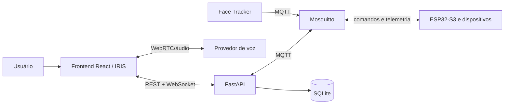

# Arquitetura do sistema

## Contexto

## Decisão estrutural

Manter **monólito modular** no backend enquanto escala e domínio não justificarem microserviços. Separar adaptadores externos por interfaces.

## Componentes atuais

- frontend: visualização, controles, áudio e eventos;
- backend: API, estado agregado, persistência e tradução MQTT;
- broker: barramento local;
- firmware: atuação física parcial;
- scripts: visão e simulação.

## Arquitetura-alvo incremental

- `CommandService`: valida e registra comandos;
- `StateService`: reconcilia desired/reported state;
- `DeviceRegistry`: capacidades e tópicos por dispositivo;
- `VoiceGateway`: abstrai OpenAI, Gemini ou TTS/STT separados;
- `AuditLog`: registra ator, ação, resultado e latência;
- `HealthService`: consolida integridade dos módulos.

## Restrições

- um único worker enquanto houver estado global em memória;
- nenhuma chave permanente no frontend;
- MQTT anônimo somente em laboratório isolado;
- mudanças estruturais exigem ADR.
