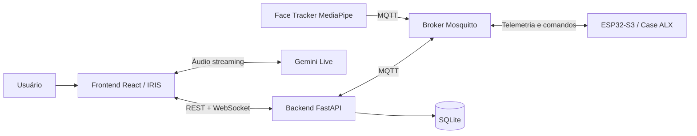
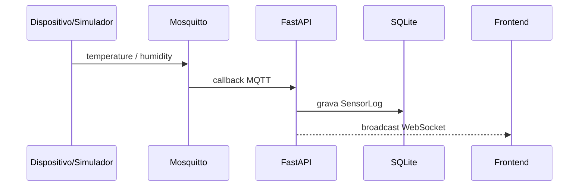
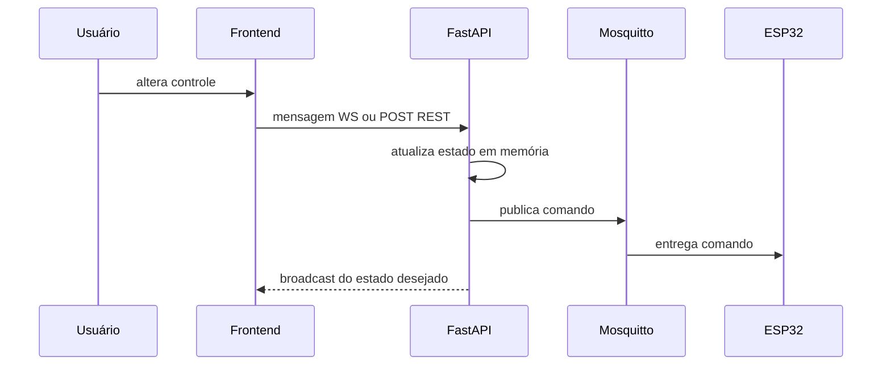
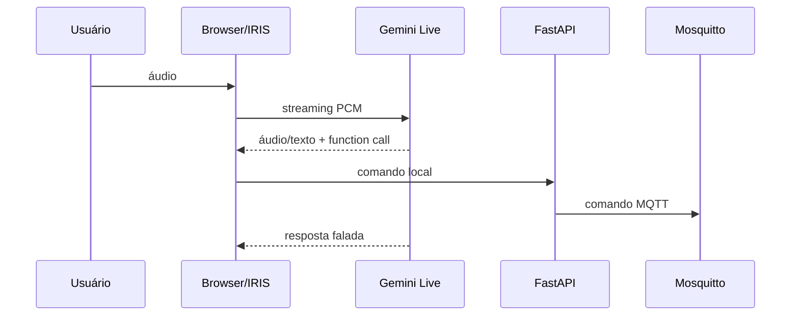
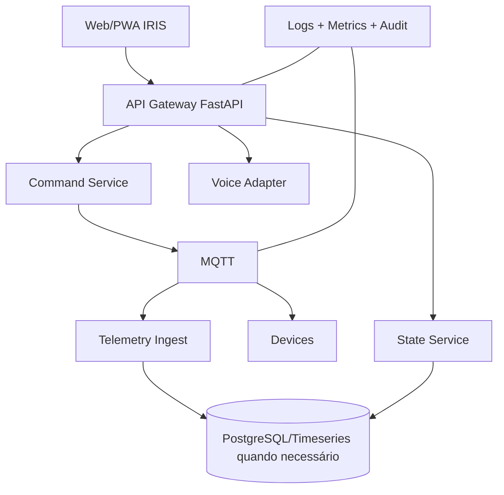

# CIRCE Home Platform — Arquitetura

**Status:** arquitetura implementada + extensões planejadas claramente separadas.
**Atualizado em:** 22/07/2026.

## 1. Objetivo arquitetural

A CIRCE Home Platform conecta uma interface conversacional e visual a dispositivos físicos locais. A arquitetura privilegia controle local, baixo acoplamento entre módulos e atualização em tempo real.

## 2. Contexto do sistema

A nuvem participa hoje da conversação por voz. O controle físico permanece local: a interface transforma chamadas de função em comandos enviados ao backend, que os traduz para MQTT.

## 3. Componentes implementados

### 3.1 Frontend

**Responsabilidades**

- apresentar estado térmico e operacional;
- renderizar o orbe 3D e seus estados visuais;
- controlar fans, aletas e LEDs;
- manter conexão WebSocket;
- usar REST como fallback de envio de comando;
- capturar/reproduzir áudio e conversar com Gemini Live;
- refletir face tracking e estado de voz na interface.

**Módulos-chave**

- `src/App.tsx`: composição da aplicação, WebSocket, controles e voz.
- `src/components/OrbCanvas.tsx`: motor visual 3D.
- `src/store/irisStore.ts`: estado global Zustand.
- `src/services/voiceService.ts`: Gemini Live.
- `src/services/gptRealtimeService.ts`: adaptador experimental OpenAI Realtime.
- `src/components/panel/*`: painel avançado de personalização visual.

### 3.2 Backend

**Responsabilidades**

- manter estado operacional agregado;
- receber telemetria por MQTT;
- expor REST e WebSocket;
- publicar comandos MQTT;
- persistir histórico de sensores e configurações.

**Módulos-chave**

- `app/main.py`: API, estado, broadcast, integração e inicialização.
- `app/mqtt.py`: adaptador Paho MQTT.
- `app/models.py`: Device, SensorLog e Config.
- `app/database.py`: engine e sessões SQLite.

### 3.3 Broker MQTT

Mosquitto atua como barramento desacoplado entre backend, firmware e serviços auxiliares. O broker é o único serviço coberto pelo Compose atual.

### 3.4 Firmware ESP32-S3

O firmware controla o mecanismo físico de abertura/fechamento por servo contínuo e fins de curso. Ele recebe comandos MQTT e publica estado. O firmware atual ainda não implementa sensores DHT22, PWM de fans ou WS2812B descritos em documentos de produto.

### 3.5 Serviço de visão

`face_tracker.py` usa MediaPipe Face Mesh, publica coordenadas normalizadas e mantém posição com suavização/hold. Ele não controla diretamente servos PTZ no estado atual.

## 4. Fluxos principais

### 4.1 Telemetria

### 4.2 Controle físico

Observação: o frontend recebe confirmação do **estado desejado pelo backend**, não necessariamente confirmação física do atuador. Para confiabilidade, o firmware deve publicar estado observado/ack.

### 4.3 Voz com function calling

## 5. Estado e consistência

O backend usa um singleton `SystemState` em memória. SQLite armazena logs/configuração, mas não é a fonte do estado operacional atual. Isso funciona para MVP de instância única, porém limita:

- reinicialização sem perda de estado;
- múltiplos workers FastAPI;
- reconciliação entre comando desejado e estado físico;
- auditoria de comandos.

**Evolução recomendada:** separar `DesiredState`, `ReportedState` e `SystemHealth`, persistindo comandos e acknowledgements.

## 6. Topologia de implantação atual

- frontend: processo Vite separado, porta 3000;
- backend: Uvicorn separado, porta 8001;
- broker: container Mosquitto, porta 1883;
- SQLite: arquivo local ao processo backend;
- scripts de visão/simulação: processos Python separados.

## 7. Arquitetura-alvo incremental

Não é recomendável decompor em microserviços agora. A separação inicial pode permanecer modular dentro do monólito FastAPI.

## 8. Restrições arquiteturais

- comandos críticos devem continuar operando sem IA em nuvem;
- nenhuma chave secreta deve ser embutida no bundle frontend em produção;
- MQTT não deve permanecer anônimo fora de laboratório isolado;
- não usar múltiplos workers enquanto o estado estiver em memória;
- alterações arquiteturais exigem ADR.
