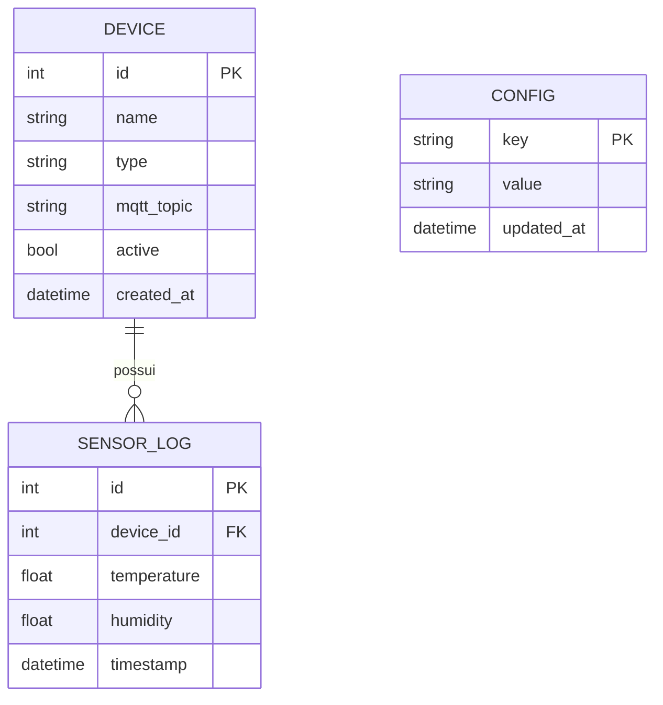

# CIRCE Home Platform — Modelo de Dados

## SQLite atual

## Uso atual

- `Device`: seed do case Alienware ALX.
- `SensorLog`: histórico de temperatura/umidade.
- `Config`: limites térmicos e velocidades padrão.

## Limitações

- `Config.value` não tem tipo nem validação.
- logs podem conter só temperatura ou só umidade.
- estado operacional não é persistido.
- não há auditoria de comandos.
- não há migrations Alembic.

## Extensões recomendadas

### CommandLog

- id/command_id;
- device_id;
- capability;
- requested_value;
- requested_at;
- source;
- status;
- confirmed_at;
- reported_value;
- error.

### DeviceState

- device_id + capability;
- desired_value;
- reported_value;
- desired_at;
- reported_at;
- quality/online.

### VoiceSessionMetadata

Somente metadados mínimos, sem áudio por padrão: provider, início, fim, latência e resultado de chamadas de função.
